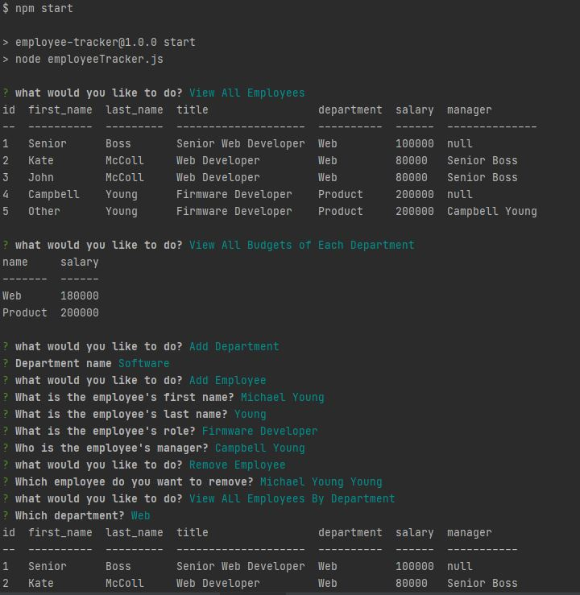

# Employee-Tracker

## Description
Building a solution for managing a company's employees using node, inquirer, and MySQL.
### Video Link:


## Table of Contents
- [User Story](#user-story)
- [Instructions](#instructions-for-project)
- [Installation](#installation)
- [Usage](#usage)
- [Results](#results)
- [Contribution](#contribution)
- [License](#license)
- [Questions](#questions)

## User Story

```md
As a business owner
I want to be able to view and manage the departments, roles, and employees in my company
So that I can organize and plan my business
```

## Instructions For Project
Design the following database schema containing three tables:


## Installation
npm install

## Usage
npm start

## Results


## License
MIT License

Copyright (c) 2021 Kate McColl

## Contribution
Open to contributions

## Questions
If you have any questions, please contact me by Email: kate@katemccollart.com GitHub: [katemccoll](https://github.com/katemccoll)
